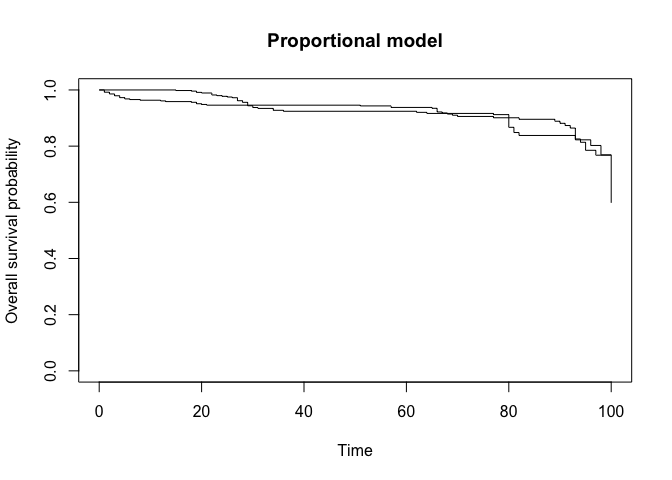
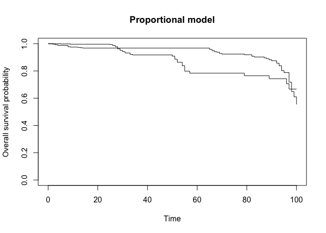

Group Project1\_Monte Carlo Simulation Design.
================
hw2849
02/15/2022

## Topic 2: Design a simulation study to assess the three hypothsis testings

Design a set of distributions/models under both proportional-hazard and
non-proportional-hazard assumptions, and carry out a simulation study to
compare performance of those hypothesis tests in those models. Based on
your numerical investigations, write a practical recommendation for
general users to choose a suitable testing tool.

## Scenario1:

### Non-proportional

Under non-proportional test assumption, we generate data set of a sample
size n = 1000, from two different distributions, exponential
distribution (p = 500) and Weibull distribution (p = 500). We have a
time variable, treatment and control group, and an event variable
indicating censoring.

``` r
# sampling survival times from exponential distribution & Weibull distribution
set.seed(8160)
N = 500
treatment = rbinom(N, 1, 0.5) #trt or ctl

prop_data = data.frame(
  eventime = c(rexp(N, 0.1), rweibull(N, 0.6, 1)), 
  treatment
) %>% 
  mutate(
    status = case_when(eventime >= 4 ~ 0, 
                      eventime < 4 ~ 1)
  )

plot(survfit(Surv(eventime, status) ~ treatment, data = prop_data), 
    main = "Non-Proportional model",
     xlab = "Time", 
     ylab = "Overall survival probability")
```

<!-- -->

``` r
## Non-proportional: log-rank and weighted log-rank tests 

logrank.test(prop_data$eventime, prop_data$status, prop_data$treatment, rho = 0, gamma = 0)
```

    ## Call:
    ## logrank.test(time = prop_data$eventime, event = prop_data$status, 
    ##     group = prop_data$treatment, rho = 0, gamma = 0)
    ## 
    ##     N Observed Expected (O-E)^2/E (O-E)^2/V
    ## 1 544      333      342     0.251     0.557
    ## 2 456      289      280     0.307     0.557
    ## 
    ##  Chisq= 0.6  on 1 degrees of freedom, p= 0.5
    ##  rho   =  0 gamma =  0

``` r
logrank.test(prop_data$eventime, prop_data$status, prop_data$treatment, rho = 1, gamma = 0)
```

    ## Call:
    ## logrank.test(time = prop_data$eventime, event = prop_data$status, 
    ##     group = prop_data$treatment, rho = 1, gamma = 0)
    ## 
    ##     N Observed Expected (O-E)^2/E (O-E)^2/V
    ## 1 544      333      342     0.251       1.1
    ## 2 456      289      280     0.307       1.1
    ## 
    ##  Chisq= 0.7  on 1 degrees of freedom, p= 0.4
    ##  rho   =  1 gamma =  0

``` r
logrank.test(prop_data$eventime, prop_data$status, prop_data$treatment, rho = 0, gamma = 1)
```

    ## Call:
    ## logrank.test(time = prop_data$eventime, event = prop_data$status, 
    ##     group = prop_data$treatment, rho = 0, gamma = 1)
    ## 
    ##     N Observed Expected (O-E)^2/E (O-E)^2/V
    ## 1 544      333      342     0.251      4.31
    ## 2 456      289      280     0.307      4.31
    ## 
    ##  Chisq= 0.2  on 1 degrees of freedom, p= 0.7
    ##  rho   =  0 gamma =  1

``` r
logrank.maxtest(prop_data$eventime, prop_data$status, prop_data$treatment)
```

    ## Call:
    ## logrank.maxtest(time = prop_data$eventime, event = prop_data$status, 
    ##     group = prop_data$treatment)
    ## 
    ##  Two sided p-value = 0.563 (Bonferroni corrected: 1)
    ## 
    ##  Individual weighted log-rank tests:
    ##   Test      z     p
    ## 1    1 -0.747 0.455
    ## 2    2 -0.392 0.695
    ## 3    3 -0.851 0.395

``` r
## power test
ctl = prop_data %>% 
  filter(treatment == 0)
trt = prop_data %>% 
  filter(treatment == 1)
mu1 = mean(prop_data$eventime)
mu2 = mean(prop_data$eventime)
Var = var(prop_data$eventime)
H = (mu1- mu2)/Var
pwr = pwr.t2n.test(n1 = nrow(ctl), n2 = nrow(trt), d = H, sig.level = 0.05)
type2e = 1 - pwr$power
```

**Decisions**

*Log-rank test:* The Chi-Squared test statistic is 0.6 with 1 degree of
freedom and the corresponding p-value is 0.5. Since this p-value is
great than .05, we fail to reject the null hypothesis.

*Weighted log-rank test for an early effect:* The Chi-Squared test
statistic is 0.7 with 1 degree of freedom and the corresponding p-value
is 0.4. Since this p-value is greater than 0.05, we fail to reject the
null hypothesis.

*Weighted log-rank test for a late effect:* The Chi-Squared test
statistic is 0.2 with 1 degree of freedom and the corresponding p-value
is 0.7. Since this p-value is greater than 0.05, we fail to reject the
null hypothesis.

Therefore, when the hazard model simulated under non-proportional
assumption with exponential and Weibull distribution, all tests failed
to reject the null hypothesis. The type I errors are the p-values of
each test. The type II error is 0.95.

## Scenario 2

### Proportional-censored

Under proportional assumption, we generate survival data with
`sim.survdata` with variables `group`, `time`, and `fail`. Similarly, we
simulated with a sample size of 1000, and tested `censored` and
`uncensored`.

-   group: 1 = treatment, 0 = control

``` r
set.seed(8160)

## simulating data, censor.cond = TRUE
sim_data = sim.survdata(N = 500, T = 100, xvars = 1, censor = 0.2, censor.cond = TRUE, num.data.frames = 2) 

## data frame
prop_df = data.frame( #trt = 1, ctl = 0
  time_1 = sim_data[[1]]$data$y,
  time_0 = sim_data[[2]]$data$y,
  fail_1 = sim_data[[1]]$data$failed,
  fail_0 = sim_data[[2]]$data$failed
) %>% 
  pivot_longer( # make df readable
    time_1:fail_0,
    names_to = c(".value", "group"),
    names_sep = "_"
  ) %>% 
  mutate(group = as.numeric(group))

## plot survival curves for each group
plot(survfit(Surv(time, fail) ~ group, data = prop_df), 
     main = "Proportional model",
     xlab = "Time", 
     ylab = "Overall survival probability")
```

<!-- -->

``` r
## Proportional: log-rank tests
logrank.test(prop_df$time, prop_df$fail, prop_df$group, rho = 0, gamma = 0)
```

    ## Call:
    ## logrank.test(time = prop_df$time, event = prop_df$fail, group = prop_df$group, 
    ##     rho = 0, gamma = 0)
    ## 
    ##     N Observed Expected (O-E)^2/E (O-E)^2/V
    ## 1 500      400      376      1.54       3.2
    ## 2 500      400      424      1.36       3.2
    ## 
    ##  Chisq= 3.2  on 1 degrees of freedom, p= 0.07
    ##  rho   =  0 gamma =  0

``` r
logrank.test(prop_df$time, prop_df$fail, prop_df$group, rho = 1, gamma = 0)
```

    ## Call:
    ## logrank.test(time = prop_df$time, event = prop_df$fail, group = prop_df$group, 
    ##     rho = 1, gamma = 0)
    ## 
    ##     N Observed Expected (O-E)^2/E (O-E)^2/V
    ## 1 500      400      376      1.54      7.99
    ## 2 500      400      424      1.36      7.99
    ## 
    ##  Chisq= 2.4  on 1 degrees of freedom, p= 0.1
    ##  rho   =  1 gamma =  0

``` r
logrank.test(prop_df$time, prop_df$fail, prop_df$group, rho = 0, gamma = 1)
```

    ## Call:
    ## logrank.test(time = prop_df$time, event = prop_df$fail, group = prop_df$group, 
    ##     rho = 0, gamma = 1)
    ## 
    ##     N Observed Expected (O-E)^2/E (O-E)^2/V
    ## 1 500      400      376      1.54      12.7
    ## 2 500      400      424      1.36      12.7
    ## 
    ##  Chisq= 2.6  on 1 degrees of freedom, p= 0.1
    ##  rho   =  0 gamma =  1

``` r
logrank.maxtest(prop_df$time, prop_df$fail, prop_df$group)
```

    ## Call:
    ## logrank.maxtest(time = prop_df$time, event = prop_df$fail, group = prop_df$group)
    ## 
    ##  Two sided p-value = 0.135 (Bonferroni corrected: 0.221)
    ## 
    ##  Individual weighted log-rank tests:
    ##   Test    z      p
    ## 1    1 1.79 0.0737
    ## 2    2 1.61 0.1082
    ## 3    3 1.55 0.1207

``` r
## power test
ctl = prop_df %>% 
  filter(group == 0)
trt = prop_df %>% 
  filter(group == 1)
mu1 = mean(ctl$time)
mu2 = mean(trt$time)
Var = var(prop_df$time)
H = (mu1 - mu2)/Var
pwr = pwr.t2n.test(n1 = nrow(ctl), n2 = nrow(trt), d = H, sig.level = 0.05)
type2e = 1 - pwr$power
```

When n = 1000, T = 100, censor = 0.2, censor.cond = TRUE:

**Decisions**

*Log-rank test:* The Chi-Squared test statistic is 3.2 with 1 degree of
freedom and the corresponding p-value is 0.07. Since this p-value is
greater than .05, we fail to reject the null hypothesis.

*Weighted log-rank test for an early effect:* The Chi-Squared test
statistic is 2.4 with 1 degree of freedom and the corresponding p-value
is 0.1. Since this p-value is greater than 0.05, we fail to reject the
null hypothesis.

*Weighted log-rank test for a late effect:* The Chi-Squared test
statistic is 2.6 with 1 degree of freedom and the corresponding p-value
is 0.1. Since this p-value is less than 0.05, we fail to reject the null
hypothesis.

The power of the test is 0.949.

#### Proportional: right-censored

``` r
set.seed(8160)

## simulating data, censor.cond = false
sim_data = sim.survdata(N = 500, T = 100, xvars = 1, censor = 0.2, censor.cond = FALSE, num.data.frames = 2) 

## data frame
prop_df = data.frame( #trt = 1, ctl = 0
  time_1 = sim_data[[1]]$data$y,
  time_0 = sim_data[[2]]$data$y,
  fail_1 = sim_data[[1]]$data$failed,
  fail_0 = sim_data[[2]]$data$failed
) %>% 
  pivot_longer( # make df readable
    time_1:fail_0,
    names_to = c(".value", "group"),
    names_sep = "_"
  ) %>% 
  mutate(group = as.numeric(group))

## plot survival curves for each group
plot(survfit(Surv(time, fail) ~ group, data = prop_df), 
     main = "Proportional model",
     xlab = "Time", 
     ylab = "Overall survival probability")
```

<!-- -->

``` r
logrank.test(prop_df$time, prop_df$fail, prop_df$group, rho = 0, gamma = 0)
```

    ## Call:
    ## logrank.test(time = prop_df$time, event = prop_df$fail, group = prop_df$group, 
    ##     rho = 0, gamma = 0)
    ## 
    ##     N Observed Expected (O-E)^2/E (O-E)^2/V
    ## 1 500      389      265      58.2       103
    ## 2 500      398      522      29.5       103
    ## 
    ##  Chisq= 104  on 1 degrees of freedom, p= <2e-16
    ##  rho   =  0 gamma =  0

``` r
logrank.test(prop_df$time, prop_df$fail, prop_df$group, rho = 1, gamma = 0)
```

    ## Call:
    ## logrank.test(time = prop_df$time, event = prop_df$fail, group = prop_df$group, 
    ##     rho = 1, gamma = 0)
    ## 
    ##     N Observed Expected (O-E)^2/E (O-E)^2/V
    ## 1 500      389      265      58.2       232
    ## 2 500      398      522      29.5       232
    ## 
    ##  Chisq= 90.7  on 1 degrees of freedom, p= <2e-16
    ##  rho   =  1 gamma =  0

``` r
logrank.test(prop_df$time, prop_df$fail, prop_df$group, rho = 0, gamma = 1)
```

    ## Call:
    ## logrank.test(time = prop_df$time, event = prop_df$fail, group = prop_df$group, 
    ##     rho = 0, gamma = 1)
    ## 
    ##     N Observed Expected (O-E)^2/E (O-E)^2/V
    ## 1 500      389      265      58.2       465
    ## 2 500      398      522      29.5       465
    ## 
    ##  Chisq= 65.3  on 1 degrees of freedom, p= 6e-16
    ##  rho   =  0 gamma =  1

``` r
logrank.maxtest(prop_df$time, prop_df$fail, prop_df$group)
```

    ## Call:
    ## logrank.maxtest(time = prop_df$time, event = prop_df$fail, group = prop_df$group)
    ## 
    ##  Two sided p-value = 0 (Bonferroni corrected: 0)
    ## 
    ##  Individual weighted log-rank tests:
    ##   Test     z        p
    ## 1    1 10.17 0.00e+00
    ## 2    2  8.08 6.66e-16
    ## 3    3  9.52 0.00e+00

``` r
## power test
ctl = prop_df %>% 
  filter(group == 0)
trt = prop_df %>% 
  filter(group == 1)
mu1 = mean(ctl$time)
mu2 = mean(trt$time)
Var = var(prop_df$time)
H = (mu1 - mu2)/Var
pwr = pwr.t2n.test(n1 = nrow(ctl), n2 = nrow(trt), d = H, sig.level = 0.05)
type2e = 1 - pwr$power
```

When n = 1000, T = 100, censor = 0.2, censor.cond = FALSE
(right-censored):

**Decisions**

*Log-rank test:* The Chi-Squared test statistic is 104 with 1 degree of
freedom and the corresponding p-value is 0. Since this p-value is less
than .05, we reject the null hypothesis.

*Weighted log-rank test for an early effect:* The Chi-Squared test
statistic is 90.7 with 1 degree of freedom and the corresponding p-value
is 0. Since this p-value is less than 0.05, we reject the null
hypothesis.

*Weighted log-rank test for a late effect:* The Chi-Squared test
statistic is 65.3 with 1 degree of freedom and the corresponding p-value
is 0. Since this p-value is less than 0.05, we reject the null
hypothesis.

The power of the test is 0.938.

## repeat test for different conditions

Now we want to repeat our tests with different conditions. \* censor =
0.9

``` r
set.seed(8160)
## simulating data, censor.cond = TRUE
sim_data = sim.survdata(N = 500, T = 100, xvars = 1, censor = 0.9, censor.cond = TRUE, num.data.frames = 2) 

## data frame
prop_df = data.frame( #trt = 1, ctl = 0
  time_1 = sim_data[[1]]$data$y,
  time_0 = sim_data[[2]]$data$y,
  fail_1 = sim_data[[1]]$data$failed,
  fail_0 = sim_data[[2]]$data$failed
) %>% 
  pivot_longer( # make df readable
    time_1:fail_0,
    names_to = c(".value", "group"),
    names_sep = "_"
  ) %>% 
  mutate(group = as.numeric(group))

## plot survival curves for each group
plot(survfit(Surv(time, fail) ~ group, data = prop_df), 
     main = "Proportional model",
     xlab = "Time", 
     ylab = "Overall survival probability")
```

<!-- -->

``` r
## Proportional: log-rank tests
logrank.test(prop_df$time, prop_df$fail, prop_df$group, rho = 0, gamma = 0)
```

    ## Call:
    ## logrank.test(time = prop_df$time, event = prop_df$fail, group = prop_df$group, 
    ##     rho = 0, gamma = 0)
    ## 
    ##     N Observed Expected (O-E)^2/E (O-E)^2/V
    ## 1 500       50     48.1    0.0781     0.154
    ## 2 500       50     51.9    0.0723     0.154
    ## 
    ##  Chisq= 0.2  on 1 degrees of freedom, p= 0.7
    ##  rho   =  0 gamma =  0

``` r
logrank.test(prop_df$time, prop_df$fail, prop_df$group, rho = 1, gamma = 0)
```

    ## Call:
    ## logrank.test(time = prop_df$time, event = prop_df$fail, group = prop_df$group, 
    ##     rho = 1, gamma = 0)
    ## 
    ##     N Observed Expected (O-E)^2/E (O-E)^2/V
    ## 1 500       50     48.1    0.0781      0.18
    ## 2 500       50     51.9    0.0723      0.18
    ## 
    ##  Chisq= 0.1  on 1 degrees of freedom, p= 0.8
    ##  rho   =  1 gamma =  0

``` r
logrank.test(prop_df$time, prop_df$fail, prop_df$group, rho = 0, gamma = 1)
```

    ## Call:
    ## logrank.test(time = prop_df$time, event = prop_df$fail, group = prop_df$group, 
    ##     rho = 0, gamma = 1)
    ## 
    ##     N Observed Expected (O-E)^2/E (O-E)^2/V
    ## 1 500       50     48.1    0.0781      14.5
    ## 2 500       50     51.9    0.0723      14.5
    ## 
    ##  Chisq= 2.3  on 1 degrees of freedom, p= 0.1
    ##  rho   =  0 gamma =  1

``` r
logrank.maxtest(prop_df$time, prop_df$fail, prop_df$group)
```

    ## Call:
    ## logrank.maxtest(time = prop_df$time, event = prop_df$fail, group = prop_df$group)
    ## 
    ##  Two sided p-value = 0.203 (Bonferroni corrected: 0.386)
    ## 
    ##  Individual weighted log-rank tests:
    ##   Test     z     p
    ## 1    1 0.392 0.695
    ## 2    2 1.520 0.129
    ## 3    3 0.255 0.799

``` r
## power test
ctl = prop_df %>% 
  filter(group == 0)
trt = prop_df %>% 
  filter(group == 1)
mu1 = mean(ctl$time)
mu2 = mean(trt$time)
Var = var(prop_df$time)
H = (mu1 - mu2)/Var
pwr = pwr.t2n.test(n1 = nrow(ctl), n2 = nrow(trt), d = H, sig.level = 0.05)
type2e = 1 - pwr$power
```

When n = 1000, T = 100, censor = 0.9, censor.cond = TRUE:

**Decisions**

*Log-rank test:* The Chi-Squared test statistic is 0.2 with 1 degree of
freedom and the corresponding p-value is 0.7 Since this p-value is
greater than .05, we fail to reject the null hypothesis.

*Weighted log-rank test for an early effect:* The Chi-Squared test
statistic is 0.1 with 1 degree of freedom and the corresponding p-value
is 0.8 Since this p-value is greater than 0.05, we fail to reject the
null hypothesis.

*Weighted log-rank test for a late effect:* The Chi-Squared test
statistic is 2.3 with 1 degree of freedom and the corresponding p-value
is 0.1. Since this p-value is less than 0.05, we fail to reject the null
hypothesis.

``` r
set.seed(8160)

## simulating data, censor.cond = false
sim_data = sim.survdata(N = 500, T = 100, xvars = 1, censor = 0.9, censor.cond = FALSE, num.data.frames = 2) 

## data frame
prop_df = data.frame( #trt = 1, ctl = 0
  time_1 = sim_data[[1]]$data$y,
  time_0 = sim_data[[2]]$data$y,
  fail_1 = sim_data[[1]]$data$failed,
  fail_0 = sim_data[[2]]$data$failed
) %>% 
  pivot_longer( # make df readable
    time_1:fail_0,
    names_to = c(".value", "group"),
    names_sep = "_"
  ) %>% 
  mutate(group = as.numeric(group))

## plot survival curves for each group
plot(survfit(Surv(time, fail) ~ group, data = prop_df), 
     main = "Proportional model",
     xlab = "Time", 
     ylab = "Overall survival probability")
```

<!-- -->

``` r
logrank.test(prop_df$time, prop_df$fail, prop_df$group, rho = 0, gamma = 0)
```

    ## Call:
    ## logrank.test(time = prop_df$time, event = prop_df$fail, group = prop_df$group, 
    ##     rho = 0, gamma = 0)
    ## 
    ##     N Observed Expected (O-E)^2/E (O-E)^2/V
    ## 1 500       49     34.6      6.04      10.4
    ## 2 500       51     65.4      3.19      10.4
    ## 
    ##  Chisq= 10.4  on 1 degrees of freedom, p= 0.001
    ##  rho   =  0 gamma =  0

``` r
logrank.test(prop_df$time, prop_df$fail, prop_df$group, rho = 1, gamma = 0)
```

    ## Call:
    ## logrank.test(time = prop_df$time, event = prop_df$fail, group = prop_df$group, 
    ##     rho = 1, gamma = 0)
    ## 
    ##     N Observed Expected (O-E)^2/E (O-E)^2/V
    ## 1 500       49     34.6      6.04      12.4
    ## 2 500       51     65.4      3.19      12.4
    ## 
    ##  Chisq= 11.9  on 1 degrees of freedom, p= 6e-04
    ##  rho   =  1 gamma =  0

``` r
logrank.test(prop_df$time, prop_df$fail, prop_df$group, rho = 0, gamma = 1)
```

    ## Call:
    ## logrank.test(time = prop_df$time, event = prop_df$fail, group = prop_df$group, 
    ##     rho = 0, gamma = 1)
    ## 
    ##     N Observed Expected (O-E)^2/E (O-E)^2/V
    ## 1 500       49     34.6      6.04       575
    ## 2 500       51     65.4      3.19       575
    ## 
    ##  Chisq= 0.2  on 1 degrees of freedom, p= 0.6
    ##  rho   =  0 gamma =  1

``` r
logrank.maxtest(prop_df$time, prop_df$fail, prop_df$group)
```

    ## Call:
    ## logrank.maxtest(time = prop_df$time, event = prop_df$fail, group = prop_df$group)
    ## 
    ##  Two sided p-value = 0.0011 (Bonferroni corrected: 0.00166)
    ## 
    ##  Individual weighted log-rank tests:
    ##   Test     z        p
    ## 1    1 3.218 0.001289
    ## 2    2 0.491 0.623676
    ## 3    3 3.453 0.000555

``` r
## power test
ctl = prop_df %>% 
  filter(group == 0)
trt = prop_df %>% 
  filter(group == 1)
mu1 = mean(ctl$time)
mu2 = mean(trt$time)
Var = var(prop_df$time)
H = (mu1 - mu2)/Var
pwr = pwr.t2n.test(n1 = nrow(ctl), n2 = nrow(trt), d = H, sig.level = 0.05)
type2e = 1 - pwr$power
```

When n = 1000, T = 100, censor = 0.9, censor.cond = FALSE
(right-censored):

**Decisions**

*Log-rank test:* The Chi-Squared test statistic is 10.4 with 1 degree of
freedom and the corresponding p-value is 0001. Since this p-value is
less than .05, we reject the null hypothesis.

*Weighted log-rank test for an early effect:* The Chi-Squared test
statistic is 11.9 with 1 degree of freedom and the corresponding p-value
is 0. Since this p-value is less than 0.05, we reject the null
hypothesis.

*Weighted log-rank test for a late effect:* The Chi-Squared test
statistic is 0.2 with 1 degree of freedom and the corresponding p-value
is 0.6. Since this p-value is greater than 0.05, we fail to reject the
null hypothesis.

## Conclusion

Under proportional assumption:

-   when the sample size increase, the overall survival probability
    increases.
-   when censor rate = 0.2, and censoring is true, all three tests fail
    to reject the null hypothesis; censoring is false (right-censored),
    all three tests reject the null hypothesis.
-   similarly, when censor rate = 0.9, and censoring is true, all three
    tests fail to reject the null hypothesis; censoring is false
    (right-censored), weighted log-rank test for a late effect fail to
    reject the null hypothesis, and two other tests reject. 0.9 true
    fail, false reject

Under non-proportional assumption:

-   Variation of sample size does not have a significant change on
    results;
-   All tests failed to reject the null hypothesis.
